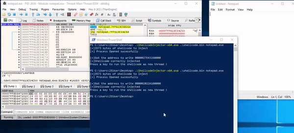

# ShellcodeInjector
A simple tool to inject shellcode inside a process of your choice. Useful for shellcode debugging.
This program simply:
- Allocate memory inside the target process
- Write the shellcode inside the target address
- Pause execution (this allow you to attach with the debugger to the injected process and set a breakpoint)
- Create the remote thread.



## Usage:
You can find the compiled executables (x86 and x64) in the Release section.
Otherwise you can compile it using Visual Studio.

Self injection
```
ShellcodeInector.exe .\shellcode.bin
```

Remote injection example:
```
ShellcodeInector.exe .\shellcode.bin notepad.exe
```
